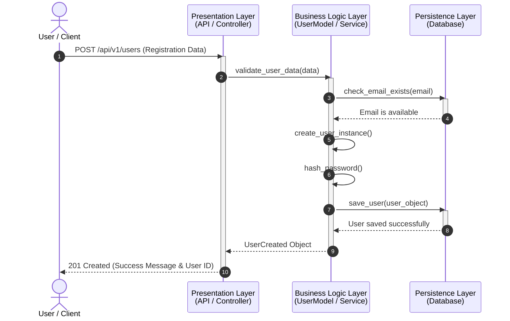
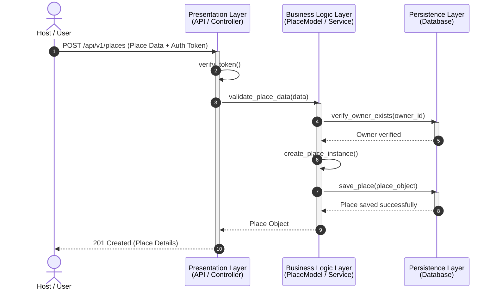
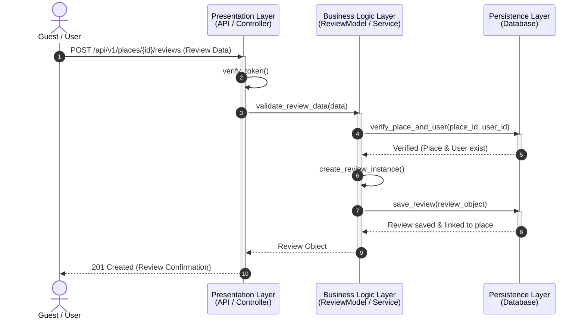
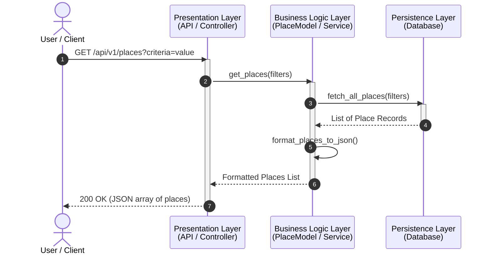

# Sequence Diagrams for HBnB API Calls

This directory contains the sequence diagrams representing the flow of interactions across the different layers of the HBnB application for four specific API calls.

## Architectural Layers Overview
* **Presentation Layer (API / Controller):** Receives the client request, validates auth tokens, and prepares the final HTTP response.
* **Business Logic Layer (Models / Services):** Processes business rules, validates incoming data models, and arranges actions.
* **Persistence Layer (Database):** Handles data storage, entity checks, and updates records in the database.

---

## 1. User Registration

### Purpose
Illustrates the workflow when a new user signs up for an account. It details how the system validates data, ensures the email is unique, hashes the password, and stores the user entity.

### Visual Diagram

---

## 2. Place Creation

### Purpose
Represents a host listing a new accommodation or place. It displays the authorization token check, owner validation, and saving the dynamic place object.

### Visual Diagram

---

## 3. Review Submission

### Purpose
Captures how a guest evaluates and leaves a review for a specific place. It focuses on validating that both the target place and the voting user exist before linking the review.

### Visual Diagram

---

## 4. Fetching a List of Places

### Purpose
Details how users browse or search through available accommodations based on specific criteria filters, highlighting data formatting before returning the outcome.

### Visual Diagram

