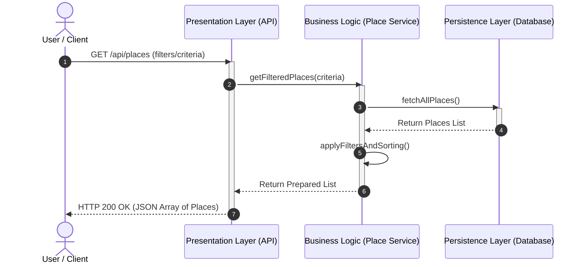

```mermaid
sequenceDiagram
    autonumber
    actor User as User / Client
    participant API as Presentation Layer (API)
    participant BL as Business Logic (Place Service)
    participant DB as Persistence Layer (Database)

    User->>API: GET /api/places (filters/criteria)
    activate API

    API->>BL: getFilteredPlaces(criteria)
    activate BL

    BL->>DB: fetchAllPlaces()
    activate DB

    DB-->>BL: Return Places List
    deactivate DB

    BL->>BL: applyFiltersAndSorting()

    BL-->>API: Return Prepared List
    deactivate BL

    API-->>User: HTTP 200 OK (JSON Array of Places)
    deactivate API
```
