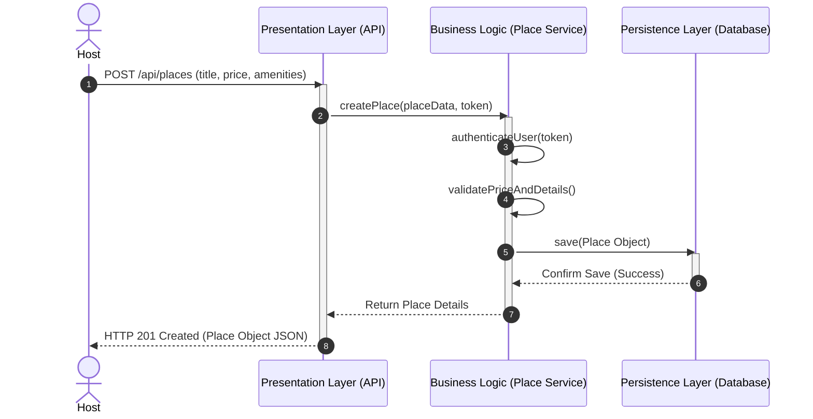

```mermaid
sequenceDiagram
    autonumber

    actor Host
    participant API as Presentation Layer (API)
    participant BL as Business Logic (Place Service)
    participant DB as Persistence Layer (Database)

    Host->>API: POST /api/places (title, price, amenities)
    activate API

    API->>BL: createPlace(placeData, token)
    activate BL

    BL->>BL: authenticateUser(token)
    BL->>BL: validatePriceAndDetails()

    BL->>DB: save(Place Object)
    activate DB

    DB-->>BL: Confirm Save (Success)
    deactivate DB

    BL-->>API: Return Place Details
    deactivate BL

    API-->>Host: HTTP 201 Created (Place Object JSON)
    deactivate API
```
