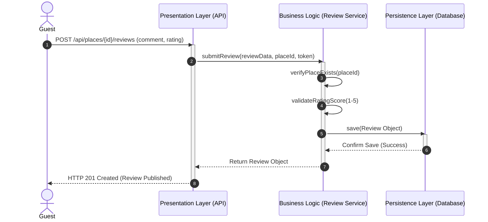

```mermaid
sequenceDiagram
    autonumber

    actor Guest
    participant API as Presentation Layer (API)
    participant BL as Business Logic (Review Service)
    participant DB as Persistence Layer (Database)

    Guest->>API: POST /api/places/{id}/reviews (comment, rating)
    activate API

    API->>BL: submitReview(reviewData, placeId, token)
    activate BL

    BL->>BL: verifyPlaceExists(placeId)
    BL->>BL: validateRatingScore(1-5)

    BL->>DB: save(Review Object)
    activate DB

    DB-->>BL: Confirm Save (Success)
    deactivate DB

    BL-->>API: Return Review Object
    deactivate BL

    API-->>Guest: HTTP 201 Created (Review Published)
    deactivate API
```
