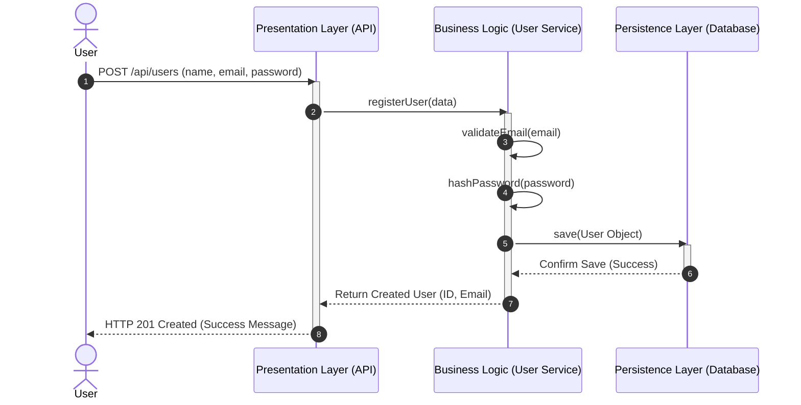

```mermaid
sequenceDiagram
    autonumber

    actor User
    participant API as Presentation Layer (API)
    participant BL as Business Logic (User Service)
    participant DB as Persistence Layer (Database)

    User->>API: POST /api/users (name, email, password)
    activate API

    API->>BL: registerUser(data)
    activate BL

    BL->>BL: validateEmail(email)
    BL->>BL: hashPassword(password)

    BL->>DB: save(User Object)
    activate DB

    DB-->>BL: Confirm Save (Success)
    deactivate DB

    BL-->>API: Return Created User (ID, Email)
    deactivate BL

    API-->>User: HTTP 201 Created (Success Message)
    deactivate API
```
